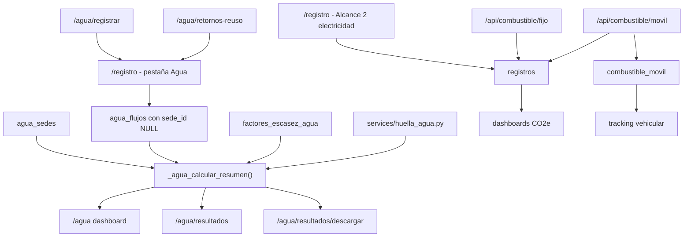
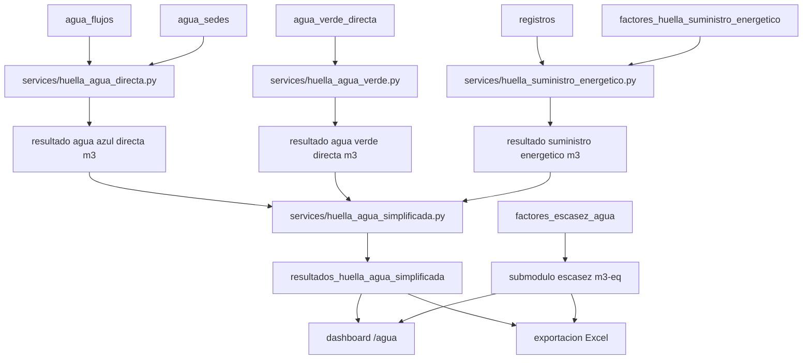

# Plan de migracion: Huella de Agua Simplificada con suministro energetico

## 1. Objetivo y alcance

Este documento define una migracion incremental para completar el modulo de **Huella de Agua Simplificada** en GreenTrack, incorporando:

- Agua azul directa: captaciones externas menos retornos verificables al mismo sistema hidrico.
- Agua verde directa: uso directo de agua lluvia o humedad aprovechada operacionalmente, cuando exista dato explicito.
- Suministro energetico: huella de agua indirecta asociada a electricidad y combustibles ya registrados en la plataforma.

El modulo debe mantener lenguaje metodologico prudente: **estimacion operacional simplificada basada en metodologia Water Footprint**, sin declarar verificacion externa ni evaluacion completa de ciclo de vida.

Quedan fuera de esta fase:

- Verificacion externa o conformidad metodologica formal.
- Evaluacion completa de ciclo de vida.
- Calidad de efluentes como impacto hidrico.
- Factores inventados o valores por defecto no trazables.
- Eliminacion de tablas historicas.

## 2. Inventario actual relacionado

### 2.1 Tablas existentes

Las tablas se crean actualmente en `init_db()` dentro de `app.py`.

| Tabla | Uso actual | Observaciones para migracion |
| --- | --- | --- |
| `agua_sedes` | Sedes/instalaciones con region, comuna, coordenadas y cuenca. | Debe mantenerse. Hoy sirve para escasez por ubicacion, pero los registros nuevos de `/registro` pueden guardarse sin sede. |
| `agua_flujos` | Flujos fisicos de agua: `captacion`, `retorno`, `reuso`. | Es la tabla base para agua azul directa. Falta clasificar agua azul/verde/no convencional. `sede_id` esta permitido como `NULL` por compatibilidad historica. |
| `factores_escasez_agua` | Factores caracterizados en `m3-eq/m3` con trazabilidad. | Se mantiene como submodulo de escasez. No debe usarse para crear huella total en `m3`. |
| `resultados_huella_agua` | Resultados caracterizados por sede/periodo/version. | Se mantiene para escasez hidrica. No cubre suministro energetico ni agua verde. |
| `agua_consumo` | Modulo historico: agua embotellada, hielo y tratamiento. | Mantener como historico/calidad/operacion. No usar como fuente principal de huella simplificada sin mapeo manual. |
| `agua_afluentes` | Historico de afluentes con caudal y tratamiento. | Puede apoyar migracion revisada, pero semanticamente no distingue captacion/retorno/reuso con suficiente trazabilidad. |
| `agua_cuencas` | Historico por tipo de cuenca y cantidad. | No migrar automaticamente a indicadores nuevos sin revision. |
| `agua_costos` | Costos asociados a agua. | Mantener como dato financiero complementario. |
| `registros` | Tabla maestra de actividades y emisiones CO2e. Contiene electricidad, combustion fija, movil y otros alcances. | Fuente principal propuesta para suministro energetico, porque ya consolida actividades y evita duplicar combustible movil. |
| `combustible_movil` | Tracking operativo de combustible por vehiculo. | Tabla auxiliar. La API inserta tanto aqui como en `registros`; por eso no debe sumarse junto con `registros` para huella de suministro energetico. |
| `factores_electricos` | Factores de emision electrica por anio, mes y sistema. | Sirve para CO2e, no para agua. Los factores de agua del suministro energetico deben ir en una tabla nueva y trazable. |
| `medidas_productivas` | Medida anual por empresa para intensidades. | Hoy es anual. Para intensidades mensuales debe usarse con cuidado o declarar "No disponible" si no hay dato del periodo. |
| `energeticos_empresa` | Configuracion de energeticos por empresa. | Puede usarse como ayuda de UX, no como dato cuantitativo. |
| `irec_certificados` | Evidencia de certificados electricos. | No afecta consumo fisico de agua. Puede aportar trazabilidad de origen electrico en suministro energetico si se modela. |

### 2.2 Rutas Flask existentes

| Ruta | Funcion | Uso actual |
| --- | --- | --- |
| `/agua` | `agua_dashboard()` | Dashboard del modulo de agua simplificada. Usa `_agua_calcular_resumen()`. |
| `/agua/registrar` | `agua_registrar_datos()` | Actualmente redirige a `/registro`. |
| `/agua/retornos-reuso` | `agua_retorno_reuso()` | Actualmente redirige a `/registro`. |
| `/agua/resultados` | `agua_resultados()` | Tabla de resultados fisicos y caracterizados. |
| `/agua/resultados/descargar` | `agua_resultados_descargar()` | Exportacion Excel de resultados de agua actual. |
| `/agua/metodologia` | `agua_metodologia()` | Explicacion metodologica. |
| `/agua/registro` | `agua_registro()` | Formulario historico de agua. |
| `/agua/reporte` | `agua_reporte()` | Reporte historico de agua. |
| `/registro` | `registro()` | Formulario generico de actividad; ahora tambien registra flujos de agua. |
| `/electricidad` | `electricidad_dashboard()` | Dashboard de electricidad basado en `registros`. |
| `/combustible/movil` | `combustible_movil()` | UI de combustibles moviles. |
| `/api/combustible/movil` | `api_combustible_movil()` | Inserta cada consumo en `registros` y `combustible_movil`. |
| `/combustible/fijo` | `combustible_fijo()` | UI de combustion fija. |
| `/api/combustible/fijo` | `api_combustible_fijo()` | Inserta combustion fija en `registros`. |
| `/admin/huella-hidrica` | `admin_huella_hidrica()` | Administracion de sedes, factores y cobertura. |
| `/admin/huella-hidrica/sedes` | `admin_huella_sedes()` | Crea/edita sedes. |
| `/admin/huella-hidrica/factores` | `admin_huella_factores()` | Crea/edita factores de escasez. |
| `/admin/huella-hidrica/factores/preview` | `admin_huella_preview_factores()` | Vista previa de carga masiva. |
| `/admin/huella-hidrica/factores/cargar` | `admin_huella_cargar_factores()` | Inserta carga masiva de factores. |
| `/huella-hidrica/sedes` | `huella_sedes_publico()` | Vista de sedes para administradores o empresa. |

### 2.3 Servicios existentes

| Archivo | Funcion actual | Brecha |
| --- | --- | --- |
| `services/huella_agua.py` | Calcula captacion, retornos, reuso, consumo operativo, seleccion de factor de escasez, huella `m3-eq`, calidad y exportacion. | No separa agua azul/verde/no convencional. No calcula suministro energetico. Los textos del archivo muestran problemas de codificacion que conviene corregir en una fase controlada. |

Funciones clave ya disponibles:

- `calcular_captacion_total()`
- `calcular_retornos_totales()`
- `calcular_retornos_mismo_sistema()`
- `calcular_reuso_interno()`
- `calcular_consumo_operativo_estimado()`
- `buscar_factor_escasez_mas_especifico()`
- `calcular_huella_escasez()`
- `consolidar_resultado_sede()`
- `construir_reporte_huella()`

### 2.4 Templates existentes

| Template | Uso actual |
| --- | --- |
| `templates/agua_dashboard.html` | Resumen, graficos y acceso historico. |
| `templates/agua_resultados.html` | Tabla de resultados y descarga Excel. |
| `templates/agua_metodologia.html` | Metodologia. |
| `templates/agua_registrar.html` | Formulario especifico de captacion, hoy no usado por la ruta final. |
| `templates/agua_retorno_reuso.html` | Formulario especifico de retornos/reuso, hoy no usado por la ruta final. |
| `templates/agua_registro.html` | Formulario historico. |
| `templates/agua_reporte.html` | Reporte historico. |
| `templates/registro.html` | Formulario principal de actividad; incluye pestaña Agua. |
| `templates/admin_huella_hidrica.html` | Administracion de sedes, factores y cobertura. |
| `templates/admin_huella_factores_preview.html` | Preview de carga masiva de factores. |
| `templates/huella_hidrica_sedes.html` | Listado simple de sedes. |
| `templates/electricidad_dashboard.html` | Dashboard electrico. |
| `templates/combustible_movil.html` | Registro de combustible movil por vehiculo. |
| `templates/combustible_fijo.html` | Registro de combustible fijo. |

### 2.5 Pruebas existentes

`tests/test_huella_agua.py` cubre calculos fisicos, factores de escasez, jerarquia de factores, exportacion basica, reuso no descontado dos veces y retornos que no deben descontarse.

Brecha principal: aun no hay pruebas para agua azul/verde, suministro energetico, doble conteo con `combustible_movil`, ni intensidades mensuales vs anuales.

## 3. Flujo actual de datos



Lectura importante: `combustible_movil` no es una fuente independiente para sumar consumos energeticos si ya se usa `registros`, porque `api_combustible_movil()` inserta en ambas tablas.

## 4. Problemas funcionales detectados

### 4.1 Registros de agua sin sede

En `registro()`, cuando `alcance == 'Agua'`, los inserts a `agua_flujos` usan `sede_id = NULL`.

Impacto:

- Los calculos por sede se consolidan como "Empresa".
- No se puede aplicar factor por cuenca, region o comuna a flujos sin sede.
- La cobertura administrativa puede mostrar cero sedes con datos aunque existan flujos.

Decision recomendada:

- Mantener `sede_id NULL` para historicos.
- Requerir sede en nuevos registros del modulo dedicado.
- Si la UX no pregunta sede en la aplicacion general, crear una sede operacional por defecto solo mediante configuracion explicita o asistida, no de forma silenciosa.

### 4.2 Calculo multisede consolidado

`_agua_calcular_resumen()` calcula totales agregados para toda la empresa y luego toma el primer factor disponible entre sedes. Eso puede caracterizar consumos de sedes distintas con un factor que no corresponde.

Impacto:

- Riesgo metodologico alto si hay sedes en distintas cuencas.
- La huella `m3-eq` por empresa puede mezclar ubicaciones.

Decision recomendada:

- Calcular siempre primero por `(empresa, sede_id, periodo)`.
- Consolidar empresa solo sumando resultados ya calculados por sede.
- Si un flujo historico no tiene sede, reportarlo como "sin ubicacion" y no calcular `m3-eq`.

### 4.3 Filtros de periodo inconsistentes

`_agua_calcular_resumen()` aplica `periodo` al primer query de `agua_flujos`, pero otros agregados internos como tendencia, fuente, sede y cobertura consultan toda la historia de la empresa.

Impacto:

- Dashboard y resultados pueden no coincidir para el mismo filtro.
- Exportacion puede incluir datos fuera del periodo visible.

Decision recomendada:

- Centralizar un constructor de filtros de periodo.
- Usar el mismo `WHERE` para resumen, graficos, cobertura y exportacion.
- Separar vistas mensual/anual con normalizacion explicita de periodo.

### 4.4 Intensidades mensuales con produccion anual

`medidas_productivas` guarda una medida anual por empresa. El dashboard de agua puede usar una medida anual aunque la vista sea mensual.

Impacto:

- Una intensidad mensual calculada con produccion anual queda subestimada.
- Riesgo de interpretacion incorrecta.

Decision recomendada:

- Para vista anual: usar `medidas_productivas.anio`.
- Para vista mensual: mostrar "No disponible" salvo que exista tabla mensual nueva o una regla explicita de prorrateo aceptada por el usuario.
- No dividir por cero ni por valores ausentes.

### 4.5 Duplicidad potencial entre `registros` y `combustible_movil`

`api_combustible_movil()` inserta cada consumo en `registros` y en `combustible_movil`.

Impacto:

- Si el modulo de suministro energetico suma ambas tablas, duplicara combustibles moviles.

Decision recomendada:

- Fuente cuantitativa unica para suministro energetico: `registros`.
- Usar `combustible_movil` solo para trazabilidad vehicular o para reconciliacion.
- Excluir `combustible_movil` de totales cuando exista el registro maestro.

### 4.6 Rutas de agua redirigen a formulario generico

`/agua/registrar` y `/agua/retornos-reuso` redirigen a `/registro`, aunque existen templates especificos.

Impacto:

- Dos experiencias conceptuales mezcladas: CO2e y agua.
- Retornos/reuso quedan dentro de un formulario generico, lo que aumenta errores de usuario.

Decision recomendada:

- Mantener `/registro` como ingreso unico visual si asi se quiere UX.
- Internamente separar handlers o servicios para agua.
- En fase siguiente, que `/agua/registrar` y `/agua/retornos-reuso` apunten a vistas dedicadas o anchors claros sin duplicar logica.

## 5. Nueva arquitectura recomendada



### 5.1 Principios de diseño

- Mantener `services/huella_agua.py` para escasez y compatibilidad, o dividirlo gradualmente.
- Crear servicios puros y testeables antes de modificar pantallas.
- No mezclar `m3` y `m3-eq` en columnas, totales ni graficos.
- Calcular suministro energetico en `m3`, no en `m3-eq`.
- Guardar trazabilidad del factor energetico aplicado por cada fuente/periodo.
- Tratar factores faltantes como "No disponible", no como cero.

## 6. Tablas nuevas y cambios de esquema

### 6.1 Cambios seguros a `agua_flujos`

Agregar columnas sin eliminar datos:

```sql
ALTER TABLE agua_flujos
ADD COLUMN IF NOT EXISTS clasificacion_agua TEXT;

ALTER TABLE agua_flujos
ADD COLUMN IF NOT EXISTS clasificacion_origen TEXT;

ALTER TABLE agua_flujos
ADD COLUMN IF NOT EXISTS requiere_revision_clasificacion BOOLEAN DEFAULT FALSE;
```

Valores controlados recomendados para `clasificacion_agua`:

- `azul_directa`
- `verde_directa`
- `no_convencional`
- `sin_clasificar`

Backfill recomendado:

- Para registros historicos: `sin_clasificar` y `requiere_revision_clasificacion = TRUE`.
- Para registros nuevos: clasificacion obligatoria o sugerida desde fuente de agua, pero confirmada por usuario.

No se recomienda inferir automaticamente que "Agua lluvia" siempre es agua verde directa; puede ser captacion almacenada, sustitucion de red o uso no operacional. Debe quedar trazable.

### 6.2 Nueva tabla `agua_verde_directa`

Para separar agua verde directa de flujos azules cuando el dato no proviene de captacion convencional.

```sql
CREATE TABLE IF NOT EXISTS agua_verde_directa (
    id SERIAL PRIMARY KEY,
    empresa TEXT NOT NULL,
    sede_id INTEGER,
    periodo DATE NOT NULL,
    volumen_m3 NUMERIC(18, 6) NOT NULL,
    tipo_uso TEXT,
    metodo_estimacion TEXT,
    calidad_dato TEXT,
    evidencia TEXT,
    observaciones TEXT,
    fecha_registro TIMESTAMP NOT NULL DEFAULT NOW(),
    FOREIGN KEY (empresa) REFERENCES usuarios(empresa),
    FOREIGN KEY (sede_id) REFERENCES agua_sedes(id)
);
```

### 6.3 Nueva tabla `factores_huella_suministro_energetico`

Factores de huella de agua por suministro energetico. No reemplaza factores de CO2e ni factores de escasez.

```sql
CREATE TABLE IF NOT EXISTS factores_huella_suministro_energetico (
    id SERIAL PRIMARY KEY,
    tipo_energia TEXT NOT NULL,
    categoria TEXT,
    unidad_actividad TEXT NOT NULL,
    metodo TEXT NOT NULL,
    version_metodo TEXT NOT NULL,
    factor_m3_unidad NUMERIC(18, 8) NOT NULL,
    nivel_geografico TEXT,
    codigo_geografico TEXT,
    periodo_inicio DATE,
    periodo_fin DATE,
    fuente TEXT NOT NULL,
    referencia TEXT,
    fecha_carga TIMESTAMP NOT NULL DEFAULT NOW(),
    activo BOOLEAN DEFAULT TRUE
);
```

Validaciones:

- `factor_m3_unidad > 0`.
- `metodo`, `version_metodo`, `fuente`, `tipo_energia` y `unidad_actividad` obligatorios.
- No usar factores por defecto.

### 6.4 Nueva tabla `resultados_huella_suministro_energetico`

Detalle para auditoria de energia.

```sql
CREATE TABLE IF NOT EXISTS resultados_huella_suministro_energetico (
    id SERIAL PRIMARY KEY,
    empresa TEXT NOT NULL,
    registro_id INTEGER,
    periodo DATE NOT NULL,
    fuente_registro TEXT,
    categoria_registro TEXT,
    actividad_registro TEXT,
    cantidad NUMERIC(18, 6) NOT NULL,
    unidad TEXT NOT NULL,
    factor_m3_unidad NUMERIC(18, 8),
    huella_agua_m3 NUMERIC(18, 6),
    id_factor INTEGER,
    estado_calculo TEXT NOT NULL,
    version_calculo TEXT NOT NULL,
    fecha_calculo TIMESTAMP NOT NULL DEFAULT NOW(),
    FOREIGN KEY (id_factor) REFERENCES factores_huella_suministro_energetico(id)
);
```

Restriccion recomendada:

```sql
CREATE UNIQUE INDEX IF NOT EXISTS ux_resultado_suministro_registro_version
ON resultados_huella_suministro_energetico (empresa, registro_id, version_calculo);
```

### 6.5 Nueva tabla `resultados_huella_agua_simplificada`

Consolidado en `m3`, separado de escasez `m3-eq`.

```sql
CREATE TABLE IF NOT EXISTS resultados_huella_agua_simplificada (
    id SERIAL PRIMARY KEY,
    empresa TEXT NOT NULL,
    sede_id INTEGER,
    periodo DATE NOT NULL,
    captacion_azul_m3 NUMERIC(18, 6) NOT NULL DEFAULT 0,
    retorno_mismo_sistema_m3 NUMERIC(18, 6) NOT NULL DEFAULT 0,
    consumo_azul_directo_m3 NUMERIC(18, 6) NOT NULL DEFAULT 0,
    agua_verde_directa_m3 NUMERIC(18, 6) NOT NULL DEFAULT 0,
    suministro_electrico_m3 NUMERIC(18, 6),
    suministro_combustibles_m3 NUMERIC(18, 6),
    suministro_energetico_m3 NUMERIC(18, 6),
    huella_total_simplificada_m3 NUMERIC(18, 6),
    estado_calculo TEXT NOT NULL,
    calidad_resultado TEXT,
    version_calculo TEXT NOT NULL,
    fecha_calculo TIMESTAMP NOT NULL DEFAULT NOW(),
    FOREIGN KEY (empresa) REFERENCES usuarios(empresa),
    FOREIGN KEY (sede_id) REFERENCES agua_sedes(id)
);
```

Restriccion recomendada:

```sql
CREATE UNIQUE INDEX IF NOT EXISTS ux_resultado_agua_simplificada
ON resultados_huella_agua_simplificada (empresa, sede_id, periodo, version_calculo);
```

### 6.6 Configuracion para asignar registros energeticos a sedes

Como la aplicacion general no pregunta sede, se necesita una estrategia controlada:

Opcion minima:

```sql
CREATE TABLE IF NOT EXISTS mapeo_area_sede (
    id SERIAL PRIMARY KEY,
    empresa TEXT NOT NULL,
    area TEXT NOT NULL,
    sede_id INTEGER NOT NULL,
    activo BOOLEAN DEFAULT TRUE,
    fecha_creacion TIMESTAMP NOT NULL DEFAULT NOW(),
    UNIQUE (empresa, area, sede_id),
    FOREIGN KEY (empresa) REFERENCES usuarios(empresa),
    FOREIGN KEY (sede_id) REFERENCES agua_sedes(id)
);
```

Uso:

- Si `registros.area` coincide con un mapeo activo, se asigna a esa sede.
- Si no hay mapeo, se calcula suministro energetico solo a nivel empresa y se marca como "sin sede asignada".
- No forzar una sede sin evidencia.

## 7. Compatibilidad con datos historicos

### 7.1 Politica general

- No eliminar ni truncar tablas existentes.
- No cambiar la semantica de `registros`, `combustible_movil` ni tablas historicas de agua.
- Mantener `agua_flujos.sede_id` nullable para registros ya cargados.
- Toda migracion automatica debe ser reversible o auditable.

### 7.2 Agua directa historica

Registros actuales en `agua_flujos`:

- Se conservan.
- Se marcan como `sin_clasificar` si no tienen clasificacion.
- Si no tienen sede, se muestran a nivel empresa y no se caracterizan por escasez.
- No se reasignan automaticamente a una sede.

Tablas historicas `agua_consumo`, `agua_afluentes`, `agua_cuencas` y `agua_costos`:

- Se mantienen como submodulo historico.
- No se migran automaticamente al nuevo resultado simplificado.
- Pueden exponerse como "datos historicos de agua / calidad y costos".

### 7.3 Energia historica

`registros` sera la fuente principal de consumos electricos y combustibles.

Criterios:

- Electricidad: `fuente = 'Electricidad'`, unidad esperada `kWh`.
- Combustion fija: fuentes como `Combustion Fija` o categorias equivalentes en `registros`.
- Combustible movil: usar filas en `registros` con `fuente = 'Combustible Movil'` o variantes equivalentes, no sumar `combustible_movil`.
- Si un registro no tiene factor hidrico aplicable, se reporta como "sin factor de suministro energetico" y no aporta a `m3`.

## 8. Plan de implementacion por etapas

### Etapa 1: base de datos y servicios puros

- Agregar columnas de clasificacion a `agua_flujos`.
- Crear tablas nuevas de factores y resultados de suministro energetico.
- Crear `services/huella_suministro_energetico.py`.
- Crear `services/huella_agua_simplificada.py` para consolidar agua azul, verde y suministro energetico.
- Agregar pruebas unitarias de calculo.

### Etapa 2: registro y migracion de agua directa

- Rehabilitar `/agua/registrar` y `/agua/retornos-reuso` como rutas funcionales o subformularios claros.
- Validar sede para nuevos registros del modulo agua, o registrar explicitamente "sin sede" solo si el usuario confirma que no tiene ubicacion configurada.
- Agregar clasificacion azul/verde/no convencional.
- Mantener `/registro` como punto visual unico si se decide, pero usando servicios separados.

### Etapa 3: factores de suministro energetico

- Agregar administracion de factores `m3/unidad`.
- Permitir carga masiva con preview y errores por fila.
- No asumir factor por fuente si falta unidad, metodologia o vigencia.

### Etapa 4: calculo consolidado y resultados

- Calcular por periodo y sede cuando exista mapeo.
- Consolidar empresa sumando resultados homogeneos en `m3`.
- Mantener escasez en `m3-eq` como bloque separado.
- Agregar estados:
  - `calculado`
  - `solo_agua_directa`
  - `sin_factor_energia`
  - `sin_sede`
  - `datos_insuficientes`

### Etapa 5: dashboard y exportacion

- Actualizar dashboard de agua para mostrar:
  - Huella azul directa `[m3]`.
  - Huella verde directa `[m3]`.
  - Huella por suministro energetico `[m3]`.
  - Huella total simplificada `[m3]`.
  - Escasez `[m3-eq]` en seccion separada, solo si hay factor valido.
- Exportar trazabilidad por indicador, factor, fuente y periodo.

### Etapa 6: pruebas integrales y QA de usuario

- Pruebas de acceso por empresa/admin.
- Pruebas de flujo completo: registro, calculo, dashboard y descarga.
- Revision visual para evitar confundir inventario fisico con impacto caracterizado.

## 9. Plan de pruebas

### 9.1 Unitarias

- Captacion azul sin retorno.
- Captacion azul con retorno al mismo sistema.
- Captacion azul con retorno a otro sistema.
- Reuso interno no descuenta dos veces.
- Agua verde directa suma aparte y no reduce captacion azul.
- Factor de suministro energetico valido calcula `m3`.
- Sin factor de suministro energetico devuelve "No disponible".
- Factor de suministro energetico cero o negativo se rechaza.
- Jerarquia de factor energetico por ubicacion si aplica.
- Escasez `m3-eq` no se calcula sin factor de escasez.

### 9.2 Integracion

- POST de agua directa crea `agua_flujos` con clasificacion y sede cuando corresponde.
- POST de retornos/reuso guarda destino, tratamiento y retorno mismo sistema.
- Dashboard y resultados usan el mismo filtro de periodo.
- Exportacion Excel no mezcla `m3` y `m3-eq`.
- Usuario normal solo ve su empresa.
- Admin puede gestionar factores globales.
- Combustible movil no se cuenta dos veces: comparar resultado usando `registros` vs `registros + combustible_movil`.

### 9.3 Migracion

- Historico `agua_flujos` con `sede_id NULL` permanece visible.
- Historico sin clasificacion queda como `sin_clasificar`.
- Historico sin factor energetico no genera `m3`.
- Registros energeticos de distintos periodos no contaminan filtros anuales/mensuales.

## 10. Matriz de trazabilidad

| Indicador | Unidad | Fuente de datos | Factor requerido | Resultado | Reporte |
| --- | --- | --- | --- | --- | --- |
| Captacion azul directa | `m3` | `agua_flujos` con `tipo_flujo='captacion'` y `clasificacion_agua='azul_directa'` | No | `resultados_huella_agua_simplificada.captacion_azul_m3` | Resumen, flujos, resultados |
| Retorno al mismo sistema | `m3` | `agua_flujos` con `tipo_flujo='retorno'` y `retorna_mismo_sistema_hidrico=TRUE` | No | `retorno_mismo_sistema_m3` | Resumen, resultados |
| Consumo azul directo | `m3` | Captacion azul menos retorno mismo sistema | No | `consumo_azul_directo_m3` | Resumen, resultados |
| Reuso interno | `m3` | `agua_flujos` con `tipo_flujo='reuso'` | No | Indicador fisico, no descuento adicional | Resumen, flujos |
| Agua verde directa | `m3` | `agua_verde_directa` o `agua_flujos` clasificado como verde | No | `agua_verde_directa_m3` | Resumen, resultados |
| Suministro electrico | `m3` | `registros` con `fuente='Electricidad'` | `factores_huella_suministro_energetico` por energia/unidad/periodo | `suministro_electrico_m3` | Resultados energia, trazabilidad |
| Suministro combustibles | `m3` | `registros` con fuentes de combustion fija/movil | `factores_huella_suministro_energetico` | `suministro_combustibles_m3` | Resultados energia, trazabilidad |
| Huella total simplificada | `m3` | Agua azul + verde + suministro energetico calculable | Factores energeticos solo para energia | `huella_total_simplificada_m3` | Resumen principal |
| Huella de escasez | `m3-eq` | Consumo operativo por sede | `factores_escasez_agua` valido por cuenca/subnacional/pais | `resultados_huella_agua.huella_escasez_m3eq` o calculo separado | Seccion caracterizada |
| Intensidad hidrica | `m3/unidad` | Huella total simplificada y `medidas_productivas` | No | Calculada solo si existe medida compatible | Resumen/intensidades |
| Intensidad de escasez | `m3-eq/unidad` | Huella de escasez y `medidas_productivas` | Factor de escasez valido | Calculada solo si hay `m3-eq` y medida compatible | Seccion caracterizada |

## 11. Componentes que se mantienen, reemplazan o evolucionan

### Mantener

- `agua_sedes`
- `agua_flujos`
- `factores_escasez_agua`
- `resultados_huella_agua`
- `registros`
- `combustible_movil` como auxiliar vehicular
- Templates historicos `agua_registro.html` y `agua_reporte.html`

### Reemplazar gradualmente

- Calculo agregado de `_agua_calcular_resumen()` por un servicio que calcule primero por sede/periodo.
- Rutas `/agua/registrar` y `/agua/retornos-reuso` como simples redirecciones.
- Uso de `medidas_productivas` anual para vistas mensuales.

### Crear

- Servicios de suministro energetico y consolidacion simplificada.
- Factores hidricos de suministro energetico.
- Resultados consolidados en `m3`.
- Mapeo area-sede.
- Pruebas para agua azul, verde y energia.

## 12. Criterios de aceptacion para la siguiente fase

- Ninguna tabla existente se elimina.
- Los resultados `m3` y `m3-eq` quedan separados visual y tecnicamente.
- Agua azul directa, agua verde directa y suministro energetico se calculan como componentes distintos.
- La fuente cuantitativa de combustible movil para suministro energetico es `registros`, no `combustible_movil`.
- Los historicos sin sede o sin clasificacion siguen visibles, pero marcados como pendientes/no caracterizables.
- El dashboard y la exportacion usan el mismo filtro de periodo.
- Las pruebas cubren doble conteo, periodos, sedes, factores faltantes y unidades.
